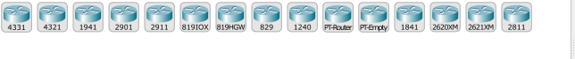
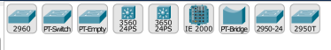
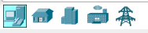
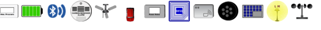
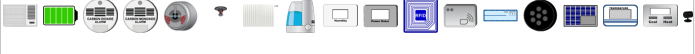
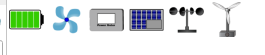

# Lab 1

### Network Devices

- 
- Routers - Switches - Hubs - Wireless Devices - Security - WAN Emulation

- Routers
  - 
  - Network routers are devices that forward data packets between computer networks. They operate at the network layer of the OSI model and are crucial for directing traffic on the internet.

- Switches
  - 
  - Network switches connect devices within a local area network (LAN). They operate at the data link layer of the OSI model and efficiently manage data traffic between devices.

- Hubs
  - 
  - Hubs are basic networking devices that connect multiple devices in a LAN. Unlike switches, hubs do not intelligently manage traffic and simply broadcast data to all connected devices.

- Wireless Devices
  - 
  - Wireless devices include access points and other components that enable wireless communication. They are essential for setting up Wi-Fi networks, allowing devices to connect without physical cables.

- Security
  - 
  - Security devices, such as firewalls and intrusion detection systems, play a vital role in safeguarding networks from unauthorized access, attacks, and other security threats.

- WAN Emulation
  - 
  - WAN emulation devices simulate wide area network (WAN) conditions in a controlled environment. This helps in testing and optimizing applications for performance over real-world network conditions.

___

### End Devices

- 
- End Devices - Home - Smart City - Industrial - Power Grid
- End devices are the ultimate recipients of data in a network. They encompass a diverse range of devices that directly interact with network services.

- End Devices
  - 
  - End devices include computers, smartphones, and other devices that directly interact with network services. They are the final destination for data in a network.

- Home
  - 
  - Home devices represent typical consumer electronics found in a household network, including computers, smart TVs, and gaming consoles.

- Smart City
  - 
  - Smart city devices include sensors, cameras, and other technologies that contribute to the development of intelligent urban infrastructure, enhancing efficiency and sustainability.

- Industrial
  - 
  - Industrial devices are used in manufacturing and industrial settings, often involving automation, monitoring, and control systems to optimize processes.

- Power Grid
  - 
  - Power grid devices are components of electrical distribution systems, including smart meters and monitoring equipment, contributing to the modernization and efficiency of power networks.

___

### Connections

- Console
  - 
  - Console connections are used for direct, out-of-band access to networking devices. They are often employed for device configuration and troubleshooting.

- Copper
  - 
  - Copper connections refer to traditional wired connections using copper cables, such as Ethernet cables. They are commonly used for reliable and high-speed data transfer within a network.

- Fiber
  - 
  - Fiber connections use optical fibers to transmit data using light signals. Fiber-optic cables offer high bandwidth, faster data transfer rates, and are resistant to electromagnetic interference.
