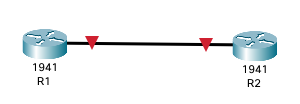

# Lab 2



- Connect R1 and R2 by their GigabitEthernet0/0 interfaces

- Set the hostnames according to the network diagram (R1 and R2)

```Bash
# to enter exec/privileged mode 
enable
# to exit form any mode
exit
# configure mode 
configure terminal
config t

# change the hostname
hostname R1 
```

- Set the enable password on each router to `123`

```Bash
enable password 123

# exit to login with the password
exit
exit
```

- View the password in the running configuration.  Is it encrypted?

```Bash
# in enable mode
show running-config
```

- Enable password encryption on each router

```Bash
exit 
service password-encryption 
```

- View the password in the running configuration.  Is it encrypted?

```Bash
exit 
show running-config 
```

- Disable password encryption on each router.

```Bash
configure terminal 
no service password-encryption  
```

- View the password in the running configuration.  Is it encrypted?

```Bash
exit 
show running-config 
```

Why is it still encrypted? 
- The command `no service password-encryption` prevents future passwords from being encrypted; however, it doesn't decrypt passwords that are already encrypted.