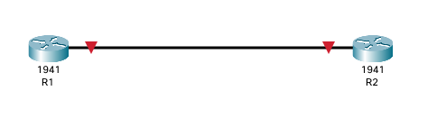

# Lab 3



- Connect R1 and R2 by their GigabitEthernet0/0 interfaces

- Set the hostnames according to the network diagram (R1 and R2)

```Bash
# to enter privileged mode 
enable
# to exit form any mode
exit
# configure mode 
configure terminal
config t

# change the hostname
hostname R1 
```

- Set the enable password on each router to `123`

```Bash
enable password 123

# exit to login with the password
exit
exit
```

- set the enable password for each Router to `ccna`

```Bash
enable secret ccna
```

- exit and see which password is used

```Bash
exit
exit
# which password?
enable # password -> `ccna`
```

- View the running configuration and which password Is encrypted?

```Bash
show running-config
```

- enable password encryption and View the running configuration.

```Bash
conf t
service password-encryption 
do show running-config
```

- save the config to startup config to prevent losing configurations

```Bash
show startup-config
copy running-config startup-config
show startup-config
# OR
write
# OR
wr

# reload Router #
reload
```
