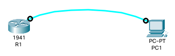

# Lab 4



- Connect PC1's RS-232 To R1

- use console connection to configure the router from PC1

```Bash
enable
configure terminal
hostname R1
```

- set enable secret of R1 to `123`

```Bash
enable secret 123
```

- set console password of R1 to `ccna` and make it required to connect to R1 by console port

```Bash
line console 0
password  ccna
login
# go to exec/privileged mode
end
exit
show running-config
```

- enable password encryption in R1

```Bash
configure terminal
service password-encryption
show  running-config
```
