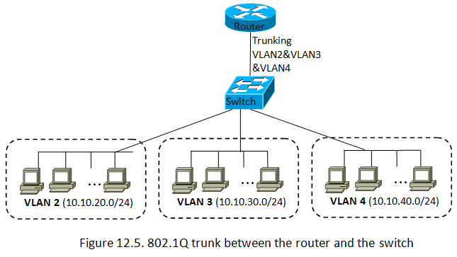
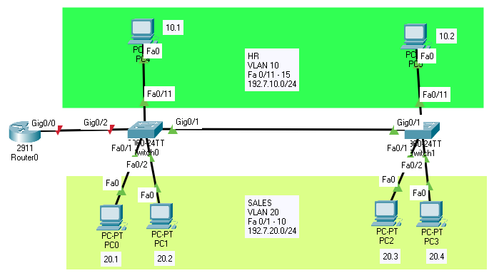

# Lab 5

### VLAN (Virtual Local Area Network)

in a VLAN, the computers, servers, and other network devices are logically connected regardless of their physical location to achieve:

- Improve Security.
- Traffic Management.
- Make a network more simple.

- VLAN 2 For HR Department
- VLAN 3 For Sales Department
- VLAN 4 For IT Department

All these departments are in the same LAN, so all network broadcast traffic is mixed in with the other departments.

Now, as an admin, you want to separate the network broadcast traffic between these departments.

Solutions:

- Switch for each department.
- VLAN.

For the 1st one, you will need a switch for each department along with cables. You may also need to physically move the computers. This solution can be costly.

For the 2nd one: 

- Create a VLAN for each department.
- VLANs can logically create several virtual networks to separate the network broadcast traffic.
- VLAN is a logical (virtual) solution, so there is no need for additional switches or cables, eliminating associated costs.
- we're going to create 3 VLANs for the 3 departments.
  - VLAN For HR Department.
  - VLAN For Sales Department.
  - VLAN For IT Department.
  - So now as the VLANs are implemented the traffic between the 3 departments are isolated, so they won't see any traffic from any department even though they share same cabling and switches.
    - 

VLAN were created on the switch by designating specific ports on the switch and assigning those ports to a specific VLAN.
