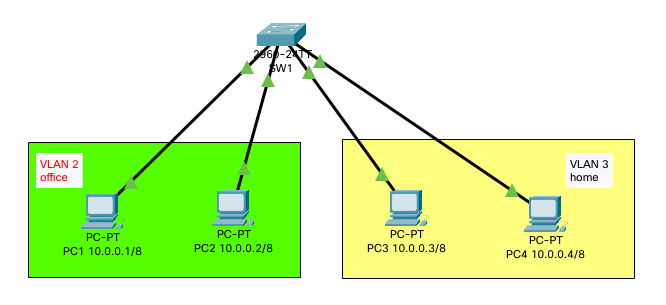
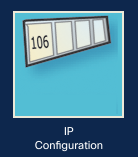
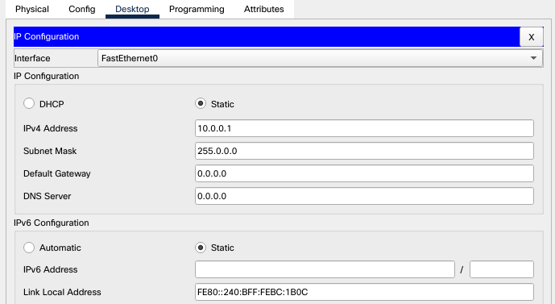

# Lab 6

### VLANs Hands-on



#### set IP for:

- `PC1`: `10.0.0.1/8`
- `PC2`: `10.0.0.2/8`
- `PC3`: `10.0.0.3/8`
- `PC4`: `10.0.0.4/8`

#### to set IP:

- press on the pc (e.g `PC1`)
- 
- 
- 
- Close and repeat these steps for all PCs.

#### Test Connections(`ping` command):

From `PC1` to `PC3`:

- press on the pc (e.g `PC1`)
- 
- 
- ```Bash
  ping 10.0.0.3
  ```
- and test for all PCs

#### configure VLANs

> _NOTE:_ VLAN 1 is for Switch

click on the Switch and select `CLI`

```Bash
enable
configure terminal

# configure VLAN 2
vlan 2
name office
exit

# configure VLAN 3
vlan 3
name home
exit
```

configure interfaces

```Bash
enable
configure terminal

# interface f0/1 to VLAN 2
interface f0/1
switchport access vlan 2
exit

# interface f0/2 to VLAN 2
interface f0/2
switchport access vlan 2
exit

# interface f0/3 to VLAN 3
interface f0/3
switchport access vlan 3
exit

# interface f0/4 to VLAN 3
interface f0/4
switchport access vlan 3
exit
```

#### Test Connections(`ping` command):

From `PC1` to `PC3`:

- press on the pc (e.g `PC1`)
- 
- 
- ```Bash
  ping 10.0.0.3
  ```
- and test for all PCs