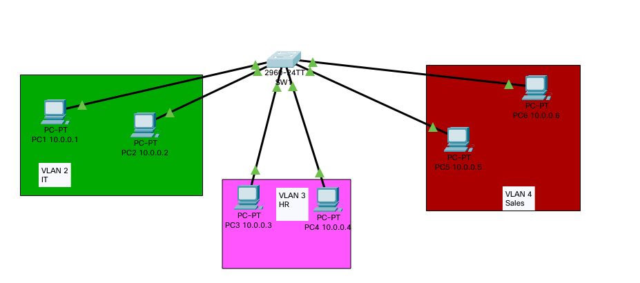

# VLAN Task



#### set IP for:

- `PC1`: `10.0.0.1/8`
- `PC2`: `10.0.0.2/8`
- `PC3`: `10.0.0.3/8`
- `PC4`: `10.0.0.4/8`
- `PC5`: `10.0.0.5/8`
- `PC6`: `10.0.0.6/8`

#### set VLANs:

- `VLAN 2`: `IT`
- `VLAN 3`: `HR`
- `VLAN 4`: `Sales`

___

configure VLANs

```Bash
enable
configure terminal

# configure VLAN 2
vlan 2
name IT
exit

# configure VLAN 3
vlan 3
name HR
exit

# configure VLAN 4
vlan 4
name Sales
exit
```

configure interfaces

```Bash
enable
configure terminal

# interface f0/1 & f0/2 to VLAN 2
interface f0/1
switchport access vlan 2
exit
interface f0/2
switchport access vlan 2
exit

# interface f0/3 & f0/4 to VLAN 3
interface f0/3
switchport access vlan 3
exit
interface f0/4
switchport access vlan 3
exit

# interface f0/5 & f0/6 to VLAN 4
interface f0/5
switchport access vlan 4
exit
interface f0/6
switchport access vlan 4
exit
```

#### Test Connections(`ping` command):

From `PC1` to `PC3`:

- press on the pc (e.g `PC1`)
- 
- 
- ```Bash
  ping 10.0.0.3
  ```
- and test for all PCs
